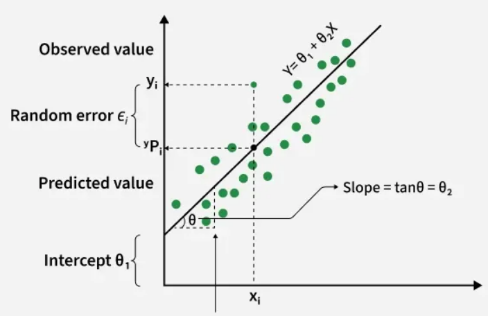
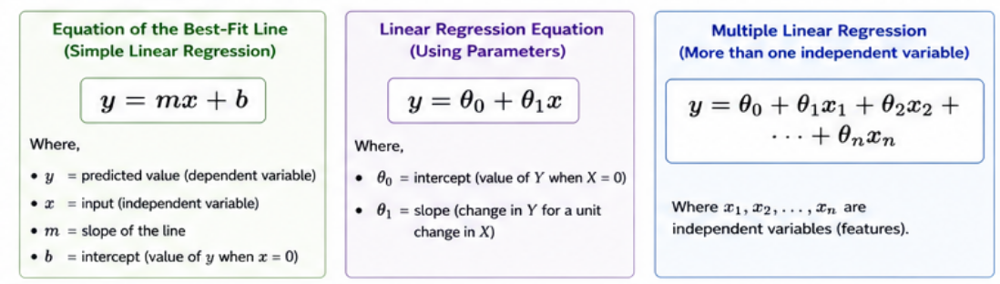
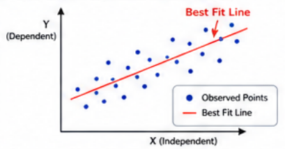
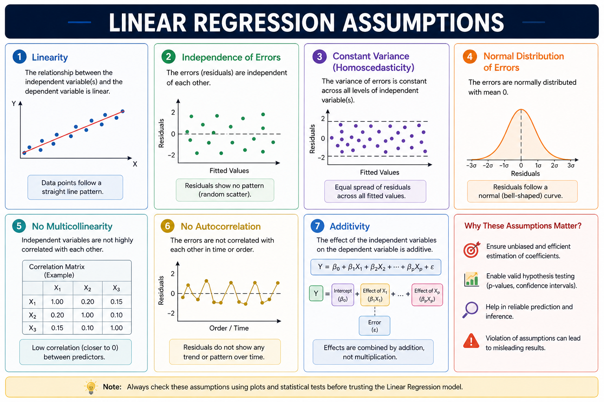

## 
Linear Regression

 

### 
Bahadursha A V L Sainadh

### 
M.Tech Machine Design

### 
M.Sc AI & ML

---
layout: two-cols-header
---
::left::
## What is Linear Regression?

- Fundamental **supervised learning algorithm**  
- Models relationship between:
  - Independent variable (X)
  - Dependent variable (Y)
- Predicts **continuous values**

## Key Points
- Assumes linear relationship  
- Uses **best-fit line**  
- Used in:
  - Predictive modeling  
  - Forecasting  

::right::

Figure: Linear Regression Overview  
Source: GeeksforGeeks

---
layout: two-cols-header
---

# Intuition + Example
::left::
## Example: Exam Score Prediction

- Predict score based on **hours studied**
- X (Independent) → Hours studied  
- Y (Dependent) → Exam score  
- More hours → higher score  & Relationship ≈ straight line with positive slope

## Example: Car Price Prediction

- Predict car price based on **age of car**
- X (Independent) → age of car
- Y (Dependent) → car price 
- More age → less car price  & Relationship ≈ straight line with negative slope
::right::

---
layout: two-cols-header
---

# Best Fit Line + Goal

  

::left::

## What is Best Fit Line?

- Line that best represents data  
- Minimizes error between:
  - Actual values  
  - Predicted values  

### Goal
- Find line with **minimum error**

::right::

  

---
layout: two-cols-header
---

# Model Evaluation (Linear Regression)

::left::
## Goal
- We want predictions to be **as close as possible** to actual values  

### Idea
- Each data point has:
  - Actual value → $y_i$
  - Predicted value → $\hat{y}_i$

👉 Goal:
- Minimize distance between:
  - Actual point  
  - Predicted point  
::right::

## From Error → Loss Function

- For one data point:

$$
\text{Error} = y_i - \hat{y}_i
$$

## Problem

- We have **multiple data points**

👉 So we take **mean of all errors**

$$
J = \frac{1}{n} \sum_{i=1}^{n} (y_i - \hat{y}_i)
$$

👉 Goal:
- Find parameters such that **loss is minimum**

---
layout: two-cols-header
---

# MAE vs MSE

Since errors can be positive or negative, we use |error| or error² so that all errors contribute equally

::left::

## Mean Absolute Error (MAE)

$$
\text{MAE} = \frac{1}{n} \sum |y_i - \hat{y}_i|
$$

- Uses absolute difference  
- All errors treated equally  

## Properties
- Robust to outliers  
- Linear penalty  

::right::

## Mean Squared Error (MSE)

$$
\text{MSE} = \frac{1}{n} \sum (y_i - \hat{y}_i)^2
$$

- Squares the error  
- Larger errors penalized more  

## Properties
- Sensitive to outliers  
- Smooth for optimization  

---
layout: two-cols
---

# Issues with MAE & MSE

::left::

## MAE Issues
- Not differentiable at 0  
- Harder for optimization  

## MSE Issues
- Sensitive to outliers  
- Large errors dominate  

## Need Better Metric

- Want measure of:
  - How well model explains data  
  - Relative performance  

👉 Leads to **R² Score**

::right::

# R² Score (Coefficient of Determination)

- Measures how well model explains variance  

## Formula

$$
R^2 = 1 - \frac{SS_{res}}{SS_{tot}}
$$

## Components

- Residual Sum of Squares:

$$
SS_{res} = \sum (y_i - \hat{y}_i)^2
$$

- Total Sum of Squares:

$$
SS_{tot} = \sum (y_i - \bar{y})^2
$$

---

---
layout: two-cols
---

# Understanding R² Score

::left::

## Case 1: $$ R^2 = 1 $$
- Perfect prediction  
- Model explains all variance  

---

## Case 2: $$ R^2 = 0 $$
- Same as predicting mean  
- No learning  

::right::

## Case 3: $$ R^2 < 0 $$
- Worse than baseline  
- Poor model  

---

## Range

$$
-\infty < R^2 \leq 1
$$

---

# Summary

- Goal → minimize prediction error  
- Loss → average error  
- MAE → robust  
- MSE → penalizes large errors  
- R² → explains model performance  

---

## Gradient Descent

- Start with random values  
- Compute error  
- Update parameters  
- Repeat  

---

<!-- 📌 IMAGE:
Cost curve + gradient descent steps

-->

---

# Assumptions

- Linearity  
- Independence of errors  
- Constant variance (Homoscedasticity)  
- Normal distribution of errors  
- No multicollinearity  
- No autocorrelation  
- Additivity  

---

<!-- 📌 IMAGE:
Assumption plots (your infographic bottom section)

-->

---

# Evaluation Metrics

- Mean Squared Error (MSE)  
- Mean Absolute Error (MAE)  
- Root Mean Squared Error (RMSE)  
- R-Squared  
- Adjusted R-Squared  

---

# Types + Use Cases

## Types

- Simple Linear Regression  
- Multiple Linear Regression  

---

## Applications

- Real Estate → price prediction  
- Finance → stock forecasting  
- Agriculture → crop yield  
- E-commerce → sales prediction  

---

# Advantages vs Limitations

## Advantages
- Simple & interpretable  
- Fast & efficient  
- Good baseline model  

---

## Limitations
- Assumes linearity  
- Sensitive to outliers  
- Cannot capture complex patterns  

---