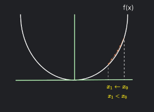
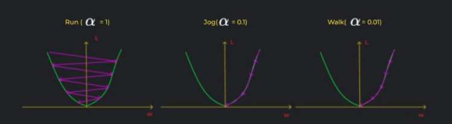
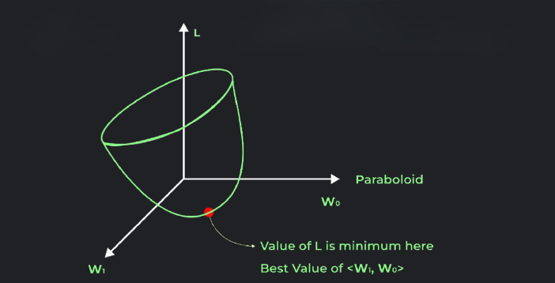
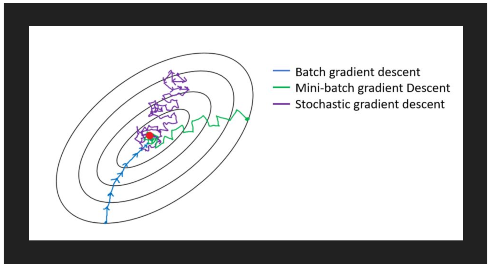

## 
Linear Regression

 

### 
Bahadursha A V L Sainadh

### 
M.Tech Machine Design

### 
M.Sc AI & ML

---
layout: two-cols-header
---
::left::
## What is Linear Regression?

- Fundamental **supervised learning algorithm**  
- Models relationship between:
  - Independent variable (X)
  - Dependent variable (Y)
- Predicts **continuous values**

## Key Points
- Assumes linear relationship  
- Uses **best-fit line**  
- Used in:
  - Predictive modeling  
  - Forecasting  

::right::

Figure: Linear Regression Overview  
Source: GeeksforGeeks

---
layout: two-cols-header
---

# Intuition + Example
::left::
## Example: Exam Score Prediction

- Predict score based on **hours studied**
- X (Independent) → Hours studied  
- Y (Dependent) → Exam score  
- More hours → higher score  & Relationship ≈ straight line with positive slope

## Example: Car Price Prediction

- Predict car price based on **age of car**
- X (Independent) → age of car
- Y (Dependent) → car price 
- More age → less car price  & Relationship ≈ straight line with negative slope
::right::

---
layout: two-cols-header
---

# Best Fit Line + Goal

  

::left::

## What is Best Fit Line?

- Line that best represents data  
- Minimizes error between:
  - Actual values  
  - Predicted values  

### Goal
- Find line with **minimum error**

::right::

  

---
layout: two-cols-header
---

# Model Evaluation (Linear Regression)

::left::
## Goal
- We want predictions to be **as close as possible** to actual values  

### Idea
- Each data point has:
  - Actual value → $y_i$
  - Predicted value → $\hat{y}_i$

👉 Goal:
- Minimize distance between:
  - Actual point  
  - Predicted point  
::right::

## From Error → Loss Function

- For one data point:

$$
\text{Error} = y_i - \hat{y}_i
$$

## Problem

- We have **multiple data points**

👉 So we take **mean of all errors**

$$
J = \frac{1}{n} \sum_{i=1}^{n} (y_i - \hat{y}_i)
$$

👉 Goal:
- Find parameters such that **loss is minimum**

---
layout: two-cols-header
---

# MAE vs MSE

Since errors can be positive or negative, we use |error| or error² so that all errors contribute equally

::left::

## Mean Absolute Error (MAE)

$$
\text{MAE} = \frac{1}{n} \sum |y_i - \hat{y}_i|
$$

- Uses absolute difference  
- All errors treated equally  

## Properties
- Robust to outliers  
- Linear penalty  

::right::

## Mean Squared Error (MSE)

$$
\text{MSE} = \frac{1}{n} \sum (y_i - \hat{y}_i)^2
$$

- Squares the error  
- Larger errors penalized more  

## Properties
- Sensitive to outliers  
- Smooth for optimization  

---
layout: two-cols
---

# Issues with MAE & MSE

::left::

## MAE Issues
- Not differentiable at 0  
- Harder for optimization  

## MSE Issues
- Sensitive to outliers  
- Large errors dominate  

## Need Better Metric

- Want measure of:
  - How well model explains data  
  - Relative performance  

👉 Leads to **R² Score**

::right::

# R² Score (Coefficient of Determination)

- Measures how well model explains variance  

$$
R^2 = 1 - \frac{SS_{res}}{SS_{tot}}
$$

Residual Sum of Squares(represents model we have built):

$$
SS_{res} = \sum (y_i - \hat{y}_i)^2
$$

Total Sum of Squares(represents baseline model or dumb model or mean model):

$$
SS_{tot} = \sum (y_i - \bar{y})^2
$$

---

  

---

# Model Interpretability (Linear Regression)

## General Model

$$
\hat{y} = w_0 + w_1 x_1 + w_2 x_2 + \cdots + w_d x_d
$$

## Example Model

$$
\hat{y} = 500 + (-10000)\cdot \text{age} + (10)\cdot \text{odometer}
$$

## How to Interpret Weights?

### Based on Sign

- If $w_i > 0$ → increase in $x_i$ increases $\hat{y}$ 
- If $w_i < 0$ → increase in $x_i$ decreases $\hat{y}$ 
- If $w_i = 0$ → no effect  

👉 Weight directly represents feature influence

---
layout: two-cols-header
---

# Magnitude + Scaling Problem

::left::

## Magnitude Interpretation

- Larger $|w_i|$ → more influence  

### Example

$$
w_{\text{age}} = -10000
$$

$$
w_{\text{odometer}} = 10
$$

### Effect

$$
\text{age} + 1 \Rightarrow \hat{y} - 10000
$$

$$
\text{odometer} + 1 \Rightarrow \hat{y} + 10
$$

::right::

## Important Question

👉 Is age really more important?

## Problem

$$
\text{age} \in [1, 15]
$$

$$
\text{odometer} \in [5000, 250000]
$$

- Weights are **not comparable due to scale**
- 👉 Solution: Feature Scaling

---

# Standard Scaler vs Min Max Scaler

## Standard Scaling

$$
x_i^{scaled} = \frac{x_i - \mu}{\sigma}
$$

## Min Max Scaling

$$
x_i^{scaled} = \frac{x_i - x_{min}}{x_{max} - x_{min}}
$$

## Final Insight

- After scaling:
  -$|w_i|$→ true importance or true interpretability

---
layout: two-cols-header
---

# Why Encoding is Necessary

::left::

## Problem

- ML models work with **numerical data only**  
- Categorical values (text) cannot be directly used  

### Example

- Color = {Red, Blue, Green}  
- Model cannot interpret these directly  

## Issue

- No inherent mathematical meaning  
- Cannot compute distance / gradients  

::right::

## Solution: Encoding

- Convert categories → numerical form  

👉 Enables:
- Mathematical operations  
- Model training  
- Feature comparison  

## Key Idea

- Preserve information while converting  
- Avoid introducing wrong relationships  

---
layout: two-cols-header
---

# Encoding Techniques

::left::

## Label Encoding

- Assign integer to each category. 
- Example: Red → 0, Blue → 1, Green → 2

⚠️ Issue: Implies false order  

## Ordinal Encoding

- Used when **order exists**
- Example: Low → 1, Medium → 2, High → 3

## One-Hot Encoding

- Creates binary columns
::right::
- OHE Example:
$$
\text{Red} = [1,0,0];
\text{Blue} = [0,1,0]
$$
- No false order

❌ Increases dimensionality

## Target Encoding

- Replace category with **mean target value**

Example:
- Category → average output  
- Useful for high-cardinality data  
---
layout: two-cols-header
---

# Gradient Descent Intuition

::left::

## Function

$$
f(x) = x^2
$$

## Steps of GD

1. Initialize $x_0$  
2. Compute gradient  

$$
\left.\frac{df}{dx}\right|_{x_0}
$$

3. Update rule  

$$
x_1 = x_0 - \alpha \frac{df}{dx}
$$
- Gradient gives direction of increase. 
- Move **opposite** to reach minima  

::right::

## Why Negative?

- If $\frac{df}{dx} > 0$ → function increasing  
- Move left to decrease value  

$$
x_1 < x_0
$$

- Update moves towards minima  

---

## Learning Rate

- $\alpha$ controls step size  
- Too large → oscillation  
- Too small → slow convergence  

---
layout: two-cols-header
---

# Loss Function & Objective

::left::

## Dataset

$$
D = \{(x^{(i)}, y^{(i)})\}_{i=1}^{m}
$$

## Model

$$
\hat{y}^{(i)} = w^T x^{(i)} + w_0
$$

## Loss (MSE)

$$
L = \frac{1}{m} \sum_{i=1}^{m} (\hat{y}^{(i)} - y^{(i)})^2
$$

## Goal

- Minimize $L$  
- Reduce prediction error  

::right::

## Why MSE?

- Smooth & differentiable  
- Works well with gradient descent  

## MAE Issue

$$
\frac{d}{dy} |y - \hat{y}| =
\begin{cases}
+1 & y > \hat{y} \\
-1 & y < \hat{y}
\end{cases}
$$

- Not differentiable at  

$$
y = \hat{y}
$$

👉 Hence MSE preferred  

---
layout: two-cols-header
---

# Geometry of Optimization

::left::

## Single Predictor

$$
L = \frac{1}{m} \sum (y - (w_0 + w_1 x))^2
$$

- Loss surface → Parabola  

## Multi Predictor

$$
L = \frac{1}{m} \sum (y - (w_0 + w_1 x_1 + \dots + w_d x_d))^2
$$

- Surface → Paraboloid  

## Insight

- One global minima  and Convex optimization  

::right::

## Interpretation

- Each weight → axis  
- Loss forms curved surface  

## Goal

$$
(w_0, w_1, \dots, w_d) \rightarrow \text{min } L
$$

👉 Best parameters at lowest point  

---
layout: two-cols-header
---

# Gradient Derivation Insight

::left::

## Loss

$$
L = (y - \hat{y})^2
$$

## Gradient w.r.t $w_0$

$$
\frac{\partial L}{\partial w_0}
= -2(y - \hat{y})
$$

## Gradient w.r.t $w_1$

$$
\frac{\partial L}{\partial w_1}
= -2(y - \hat{y}) x_1
$$

## Gradient w.r.t $w_2$

$$
\frac{\partial L}{\partial w_2}
= -2(y - \hat{y}) x_2
$$

::right::

## Pattern

👉 General form:

$$
\frac{\partial L}{\partial w_j}
= -2(y - \hat{y}) x_j
$$

## For m samples

$$
\frac{\partial L}{\partial w_j}
= \frac{1}{m} \sum -2(y^{(i)} - \hat{y}^{(i)}) x_j^{(i)}
$$

## Insight

- Error term: $(y - \hat{y})$  
- Scaled by input feature  

---
layout: two-cols-header
---

# Weight Update Rule

::left::

## Update Equation

$$
w_j = w_j - \alpha \frac{\partial L}{\partial w_j}
$$

## Example

$$
w_0 = w_0 - \alpha \frac{\partial L}{\partial w_0}
$$

$$
w_d = w_d - \alpha \frac{\partial L}{\partial w_d}
$$

## Interpretation

- Move opposite to gradient  
- Reduce loss iteratively  

::right::

## Learning Rate Effect

- Large $\alpha$ → overshoot  
- Small $\alpha$ → slow  

## Practical Tip

- Start small  
- Increase gradually  

## Behavior

- Proper $\alpha$ → smooth convergence  
- Bad $\alpha$ → divergence  

---
layout: two-cols-header
---

# Gradient Descent Variants

::left::

## Batch Gradient Descent

- Uses **entire dataset** to compute gradient  
- Stable and smooth updates  
- High computation cost  
- Slow convergence  
- 
## Stochastic Gradient Descent (SGD)

- Uses **one sample at a time**  
- Faster updates  
- Noisy and fluctuating  
- Less accurate convergence  

::right::

## Mini-Batch Gradient Descent

- Uses **small batch of samples**  
- Balance between Batch & SGD  
- Faster than Batch  
- More stable than SGD  

## Key Insight

- Batch → Accurate but slow  
- SGD → Fast but noisy  
- Mini-batch → Best trade-off  
---
layout: default
---

# Batch vs Stochastic (Comparison)

| Aspect | Batch GD | Stochastic GD |
|--------|----------|---------------|
| Data used | Entire dataset | Single sample |
| Speed | Slow | Fast |
| Accuracy | High | Lower (noisy) |
| Memory | High | Low |
| Updates | After full dataset | After each sample |
| Convergence | Smooth | Fluctuating |

- Batch is computationally expensive  
- SGD is efficient for large datasets :contentReference[oaicite:0]{index=0}  

---

---
layout: two-cols-header
---

# Epoch vs Iteration

::left::

## Iteration

- One update of weights  
- Depends on data used per step  

## Epoch

- One full pass over dataset  

::right::

## Relationship

### Batch GD

- 1 iteration = 1 epoch  

### SGD

- 1 epoch = $N$ iterations  

### Mini-Batch

- 1 epoch = $\frac{N}{\text{batch size}}$ iterations  

## Example

- Dataset = 1000 samples  
- Batch size = 100  

👉 1 epoch = 10 iterations  
---

# Assumptions

- Linearity  
- Independence of errors  
- Constant variance (Homoscedasticity)  
- Normal distribution of errors  
- No multicollinearity  
- No autocorrelation  
- Additivity  

---

<!-- 📌 IMAGE:
Assumption plots (your infographic bottom section)

-->

---

# Evaluation Metrics

- Mean Squared Error (MSE)  
- Mean Absolute Error (MAE)  
- Root Mean Squared Error (RMSE)  
- R-Squared  
- Adjusted R-Squared  

---

# Types + Use Cases

## Types

- Simple Linear Regression  
- Multiple Linear Regression  

---

## Applications

- Real Estate → price prediction  
- Finance → stock forecasting  
- Agriculture → crop yield  
- E-commerce → sales prediction  

---

# Advantages vs Limitations

## Advantages
- Simple & interpretable  
- Fast & efficient  
- Good baseline model  

---

## Limitations
- Assumes linearity  
- Sensitive to outliers  
- Cannot capture complex patterns  

---