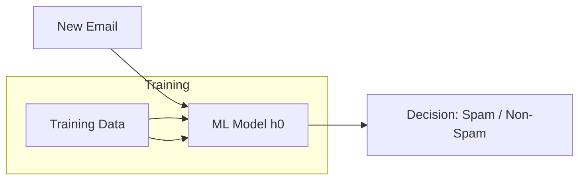
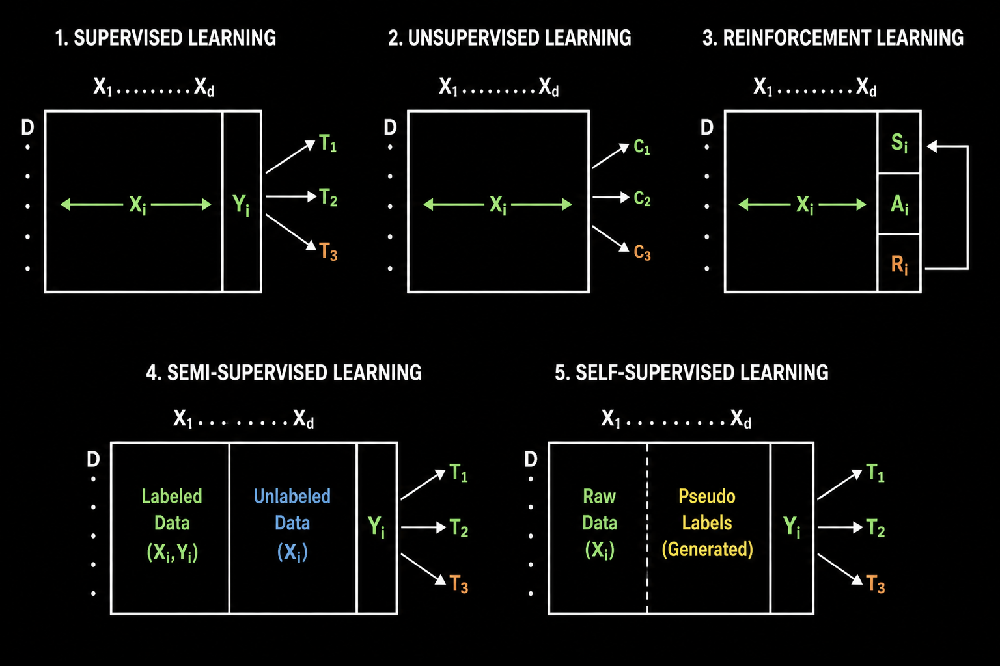

## 
Introduction to Machine Learning

 

### 
Bahadursha A V L Sainadh

### 
M.Tech Machine Design

### 
M.Sc AI & ML

---
layout: two-cols-header
---

# Prerequisites

::left::

## Python Libraries
- NumPy  
- Pandas  
- Matplotlib  
- Seaborn  

## Mathematics
- Probability & Statistics  
- Linear Algebra  
- Calculus & Optimization  

::right::

## Data Visualization Concepts

1. One Variable Plots
   * Numerical → Histogram  
   * Categorical → Count Plot  

2. Two Variable Plots
   * Numerical vs Numerical → Scatter Plot  
   * Categorical vs Numerical → Bar Plot  
   * Categorical vs Categorical → Heatmap

3. Three Variable plots
   * Numerical, Numerical, Categorical → Scatter plot with category as color   
---

# Machine Learning vs Classical Programming

## Classical Programming
- Rigid rules written by programmers  
- Heavy use of hard coding  
- Rules do not change with data  

## Machine Learning
- Learns rules from data  
- Model is trained on data  
- Adapts based on patterns  

---
layout: two-cols
---

::left::

# Example: Spam Detection

## Classical Programming
- Input: Text data  
- Use keywords and rules  
- Many if-else conditions  
- Rigid system  

## Machine Learning
- Input: Data + labels  
- Learns patterns automatically  
- No manual rule writing  

::right::

# When to Use ML?

- When patterns are not clearly visible  
- When rules are difficult to define manually  
- When system needs to adapt with data  

---
layout: two-cols-header
---

# Types of Learning

::left::

## Supervised Learning
- Output label (Y) is present  
- Learns input → output mapping  

### Example
- House price prediction  
- Fraud detection  

## Reinforcement Learning
- Agent interacts with environment  
- Learns via reward & penalty
- Key components - State, Action, Reward

### Example
- Autonomous Driving 
- Chess Engine

::right::

## Unsupervised Learning
- No output labels  
- Finds hidden patterns  

### Example
- Customer segmentation  
- Document grouping  
---
layout: two-cols-header
---

# Types of Learning (Advanced)

::left::

## Semi-Supervised Learning
- Few labeled + many unlabeled  
- Improves learning with less labeling  

### Examples
- Amazon Product Segmentation: few labeled scans + many unlabeled scans  
- Email classification with limited labeled data  

::right::

## Self-Supervised Learning
- Generates labels from data  
- Learns representations automatically  

### Examples
- Predict missing words in a sentence (LLMs)  
- Masked image patches in vision models  

---

  

---
layout: two-cols-header
---

# Types of Tasks (Part 1)

::left::

## Classification
- Predict category labels  

### Examples
- Churn prediction  
- Fraud detection  

## Regression
- Predict continuous values  

### Examples
- Credit score prediction  
- House price prediction  

::right::

## Clustering
- Group similar data points  

### Examples
- Customer segmentation  
- Document grouping  

## Recommendation
- Suggest relevant items  

### Examples
- Netflix recommendations  
- E-commerce suggestions  

---
layout: two-cols-header
---

# Types of Tasks (Part 2)

::left::

## Forecasting
- Predict future values  

### Examples
- Stock price prediction  
- Sales forecasting  

::right::

## Summary
- Classification → categories  
- Regression → continuous values  
- Clustering → grouping  
- Recommendation → suggestions  
- Forecasting → future prediction  

---
layout: two-cols-header
---

# ML Definition (ETP Framework)

> Machine learning is the study of algorithms that improve their performance (P) at a task (T) with experience (E).

::left::

# Example: Stock Price Prediction

- T: Predict stock price  
- E: Historical data  
- P: Mean Squared Error  
  
::right::

# Example: Customer Segmentation

- T: Segment customers  
- E: Transactional data  
- P: Cluster quality (intra vs inter distance)  
---